# Fullstack Milestone Project
## [Amy Hollis Photography](https://amy-hollis-photography.herokuapp.com/)

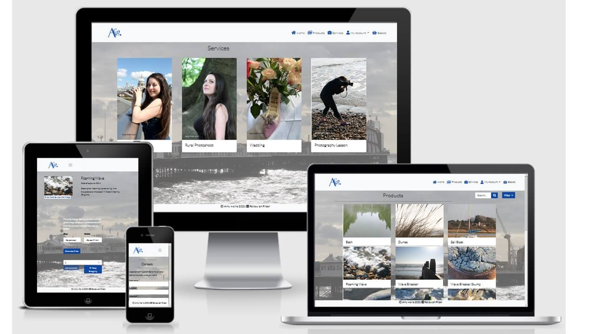

This website is for a UK based photographer to sell images that have already been taken as well as provide services such as photoshoots and lessons. It  provides clear sections for products, services and a section for users to contact the photographer should they need something that isn’t covered on other parts of the site. 
Business goals:
-	Make products and services available to users.
-	Inform users of prices bases on the specifications they have chosen.
-	Build brand awareness.
-	Manage services and products available on the website.
-	
User goals:
-	Browse and filter products that are available and get the price based off the size and finish.
-	View different types of services and get the price based off the length of the session and how they get the images from the session. 
-	Add products and services to a basket to check it out and purchase. 
-	Contact photographer if any questions or requests are not answered in the products and services pages. 

## UX
### An ideal user would be:
-	English speaking
-	Redecorating/ moving to want a print
-	Family event/ have kids
-	Getting married 
-	Wanting to learn how to take photos and use photoshop. 
### User stories:
| Story number | As a …            | I want to …                                      | So that I can…                                                                 | acceptance criteria                                                                                                                                   |
|--------------|-------------------|--------------------------------------------------|--------------------------------------------------------------------------------|-------------------------------------------------------------------------------------------------------------------------------------------------------|
| 1            | Customer          | Be able to browse products and services availble | Decide exactly what service/ product they want                                 | Browse the products/ services pages to decide what they want                                                                                          |
|              |                   |                                                  |                                                                                | They cannot find what they are looking for but are able to message the photographer                                                                   |
| 2            | Customer          | Be able to contact the photographer directly     | Discuss specific needs or ask questions that are not answered on the main site | User can successfully contact the photographer through the use of a form                                                                              |
|              |                   |                                                  |                                                                                | If the user inputs incorrect information, the form will not submit and an error will tell the user needs to be corrected                              |
| 3            | Customer          | Review my order                                  | Check that I am happy with my order before proceeding to payment               | The user can see a detailed break down of the products/services ordered                                                                               |
|              |                   |                                                  |                                                                                | Users are not happy with the contents of the basket, so have the ability to update the quantity of items or delete them                               |
| 4            | New customer      | Create an account                                | Place orders and see order history                                             | The user fills out a form that creates an account for them                                                                                            |
|              |                   |                                                  |                                                                                | The user makes an error when inputting data, the form is not submitted and the error is highlighted                                                   |
| 5            | Existing customer | See my orders, past and current                  | Track their current order                                                      | The user is able to log into their account and review the status of their order that is updated by the site owner                                     |
|              |                   |                                                  |                                                                                | The user does not enter the correct credentials and are alerted to this before they are able to log in                                                |
| 6            | Existing customer | Review my account                                | Update personal information                                                    | The user is able to submit a form with updated information                                                                                            |
|              |                   |                                                  |                                                                                | The form does not pass validation so is not submitted and these errors are highlihgted to the user                                                    |
| 7            | Site owner        | Review products and services avalible            | Add/ remove and update the pricing of products and services                    | The owner is able to manage products via a form                                                                                                       |
|              |                   |                                                  |                                                                                | The data entered is not valid so no uopdates are made until this is correct                                                                           |
| 8            | Site owner        | Be able to see current orders                    | Update the status for the customer                                             | The site owner is able to update the status of the order for the user via a form                                                                      |
|              |                   |                                                  |                                                                                | The site owner isn't able to update the order status via the form, but are able to log into Django admin and update the order as they are a superuser |
| 9            | Site owner        | Receive emails                                   | Respond to customer queries                                                    | The site owner recieves an email directly from the customer with regards to a specific query                                                          |
|              |                   |                                                  |                                                                                | The user is unable to send the email as there is an error in the submission form                                                                      |
### Wireframes:
When I started the planning process I drew up wireframes for each page. I started with the home page, for both larger and smaller screens.
 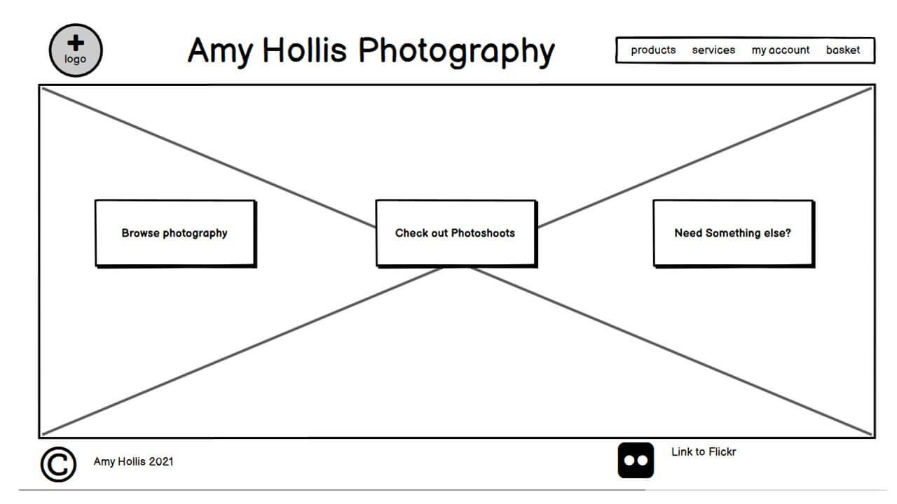 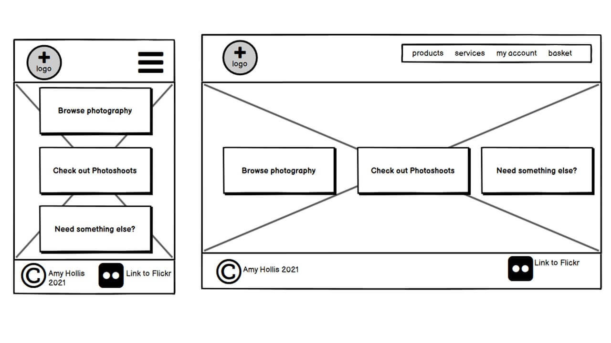
 From here I then moved to the products page (and how it would look on smaller screens). 
  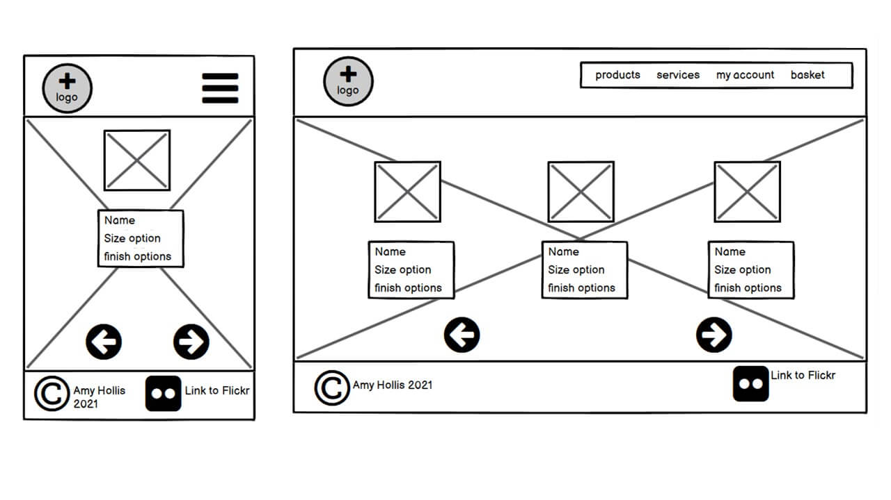
The next logical step was to plan out how the product detail page would look on mobile and tablet. 
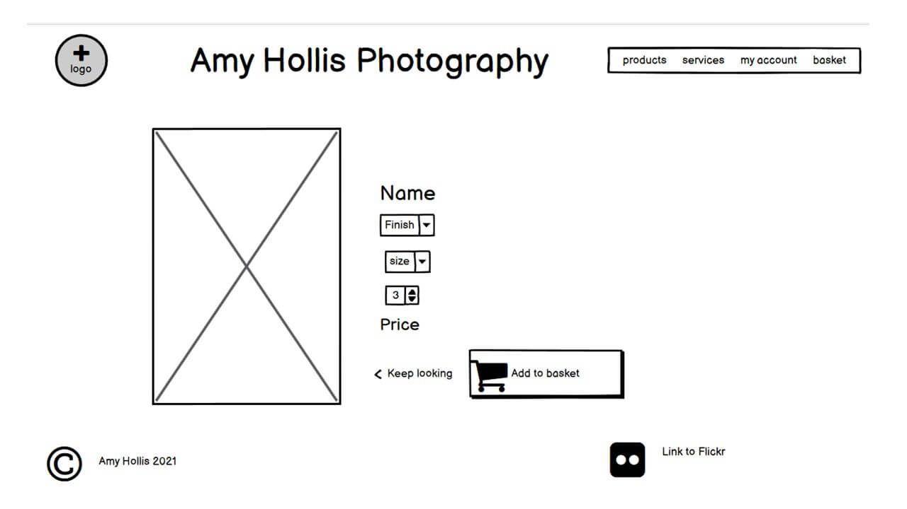 
The services (including smaller screens) would be similar to the products.
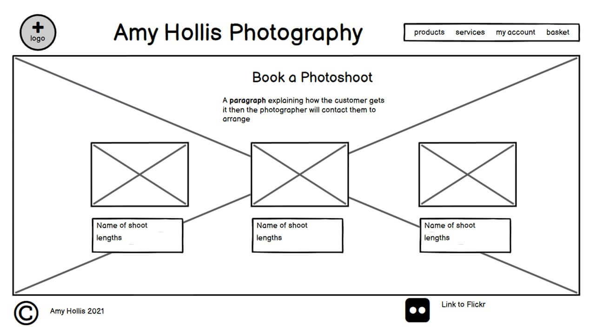 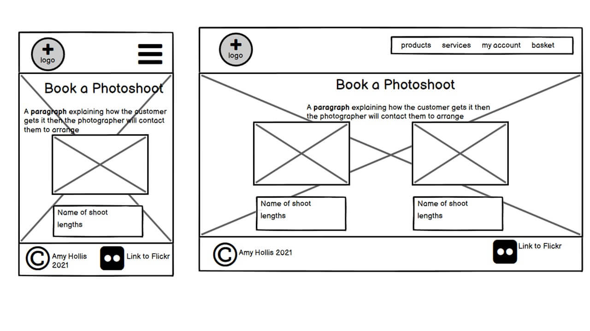
In addition, the service detail pages (on all viewports) were based off of the produsts wireframes.
 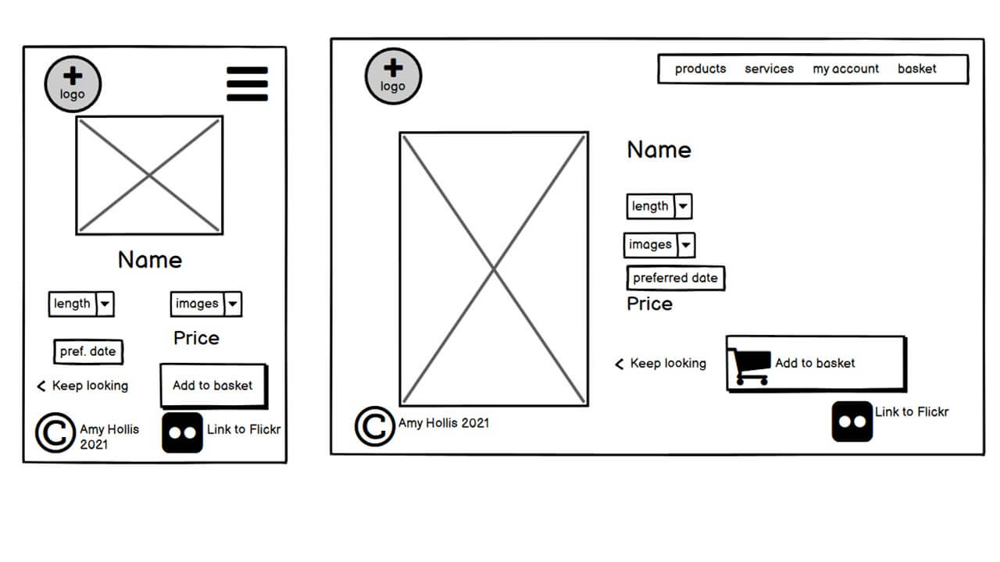
From here I continued to follow the user process through to the basket and how this would relate to smaller screens.
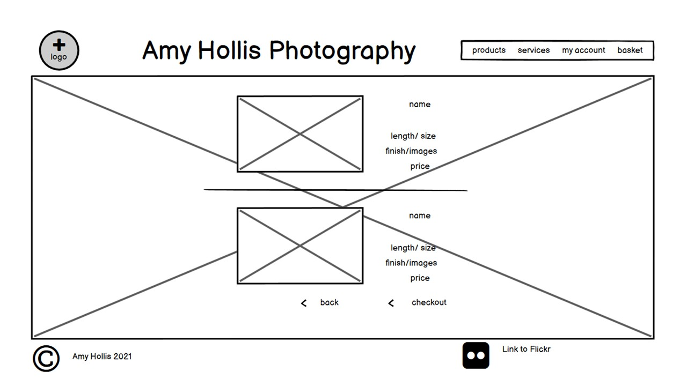 ! [smaller screens](media/basket-sm.jpg)
From here to the checkout screen on both larger and smaller screens. 
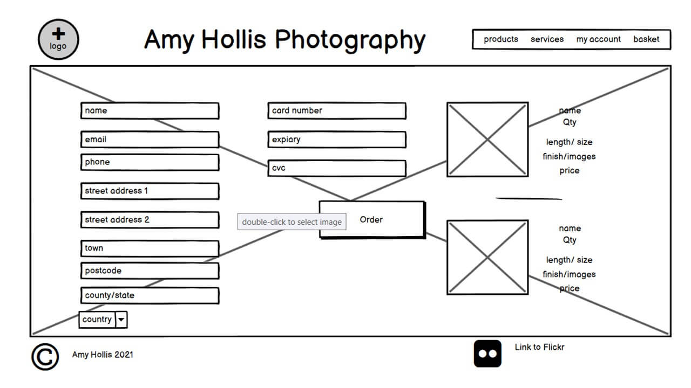 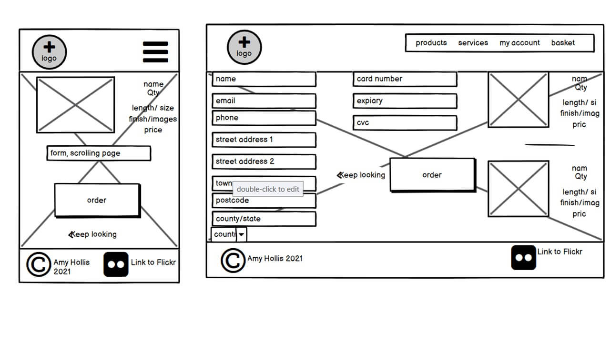
Once I had followed the bacis process throught the website, I then turned to the additional features including how the profiles page would look (and on mobile and tablet). 
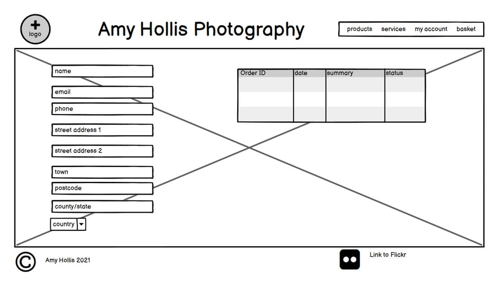 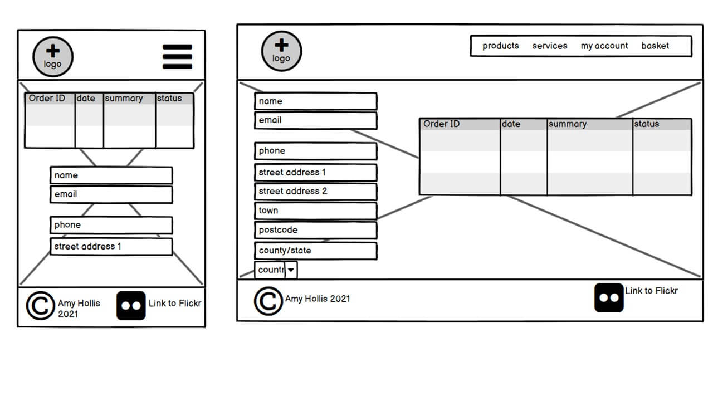
The final page that I needed to think about from a customer point of view was the contact page , (incliding other device sizes).
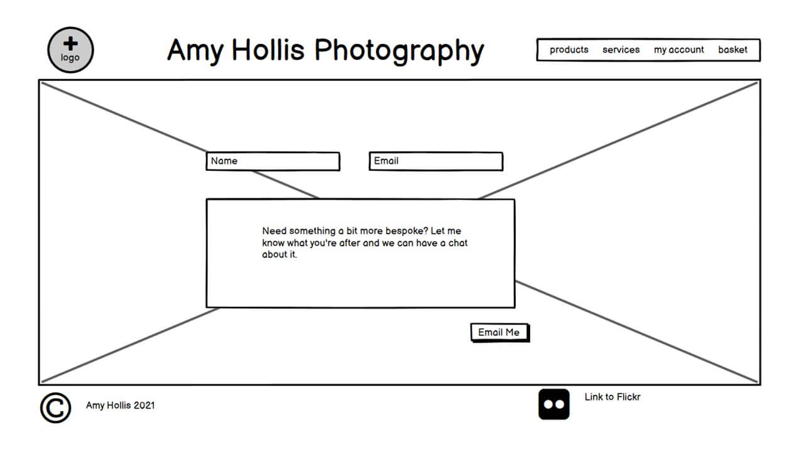 
 Now that I had looked at the website from a customer's point of view I needed to add an addtional page for the site owner so they could add products/services (on all screen sizes). This changed after feedback, so that only one form is displayed on the screen at any one time, in addition an edit product/sercice page was added, following the same style.
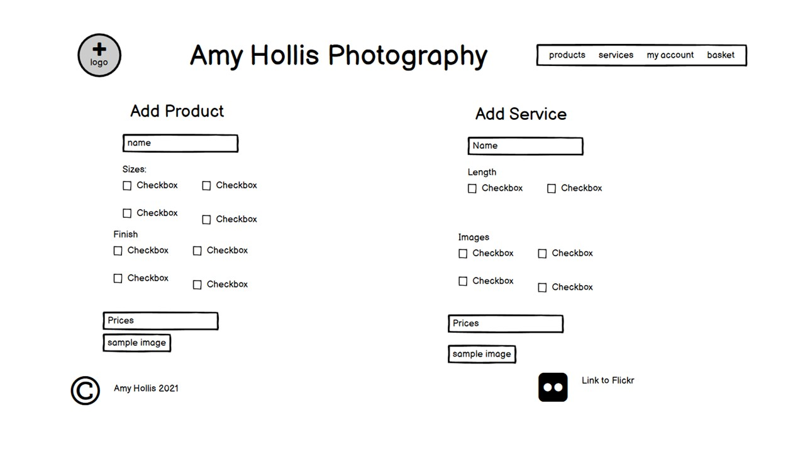 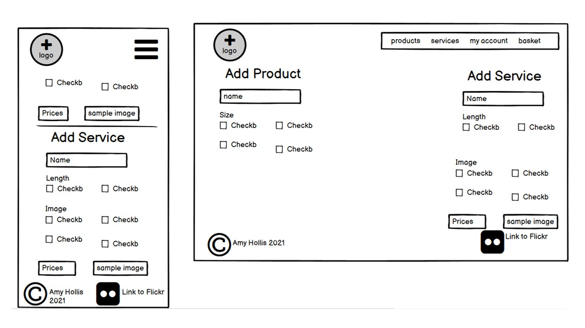
## Features
### Existing Features
While some features are specific to a particular page, there are some key features that are consistent across the site. For example the footer, with the copyright information and external link to a social media account. In addition the header of the page follows convention of a logo in the top left corner (also a link back to the home page) and the navigation menu on the right (that collapses down to a hamburger button on smaller viewports). The background image is also consistent across the whole website. This image helps bring attention to the landing page of the site, which is otherwise quite simple, it also provides a preview of the photography available for users to see as soon as they enter the site. A final feature that appears on multiple pages is the use of Django’s messages and Bootstrap’s toasts to provide the user with error, warning, info and success message about their activity on the site. 
#### Home 
The main purpose of this page is to act as a landing page of the site so that users can navigate to the section of the website. The page will have three links on it, sone to products, one to services and one to the email page. 
#### Products/ Services 
These pages will both be made up of cards, which when clicked takes you to a detail page for that product or service. The main difference between these pages with regards to the features is that the products page contains three additional features due to the significantly larger number of items on the page. The first of these is a filter option that filters the products based on the category of the image. The second feature is the search bar for users to search for a key word in the title or description of the image. The final feature that makes the products page different to the services page is the pagination at the bottom of the page. This is because of the vast number of products available on the site would mean that users would be scrolling a lot. These pages provide the read method from CRUD. 
#### Product detail/ Service detail
These pages consist of an image, either the image being selected or a sample image to represent the service. In addition there is a form with select boxes, numbers and hidden input fields. These forms will pass the relevant data to the backend to become items in the shopping basket. In addition, when logged in as the super user, there are additional links, one that deletes the item from the site, and another that allows them to update the information in it. When logged in as the super user this page provides both the update and delete functions of the CRUD methods that are used when handling data. 
#### Bag
This bag is the step between browsing items and checking out the order. The contents of the page is generated dynamically, depending on what is in the session basket. A for loop is used to generate each row on the table. In addition there is a form in each row of the basket, this allows users to update the quantity of an item in the basket or remove it from the basket. This page provides users with an opportunity to review the basket before checking out.
#### Checkout
This page contains three main features. The first of these is the order summary, this is a table that is created with a for loop, so that a new line is created for each item. This further confirms to the user what they are purchasing, and confirms that any changes made on the bag page have been successful. The second main feature of this page is the user details and delivery details. If the user is logged in, this will be prefilled in my the data in the profile (this page also gives them the option to update their details on their profile. This form is made using crispy forms and the order model. Apart from the country field (which is created with Django country forms), that is a select box, the other fields are text inputs. The final main feature of this page is the Stipe functionality. This is a way to securely send the card data to stripe. With all this information sent to Stipe to process the payment, the order is created, and a confirmation email is sent when the webhook is returned.
#### Checkout success
Once the order has been created, the user is redirected to the checkout success page. This page can also be accessed by clicking on a past order number from the profile page. The page consists of the users order summary, including the delivery details as well as a item breakdown and the order number. The only other feature on this page is a button to return the user back to the home page so that they can continue interacting with the website. 
#### Profile
This page consists of a form and a table. The form (created with crispy forms) allows users to add to/update their profiles. The table gives users an overview of their previous orders, including the total, date and the order number. This column in the form provides two uses, to show the user their order number and to provide a link to the checkout success page so that it can be viewed in more detail. The profile page requires login, so non authenticated users cannot access it. 
#### Site admin
Not only does this page require login, but it also for the user to be a super user. The site admin consist of two pages, edit item and add an item to the site. These pages consist of forms including an image field. These are generated using crispy form and customising the Django widget for images. The add to site page also consists of  a select box so that the user can pick if they are adding a product or a service. This is done using an if statement to then render the relevant context to the template. 
#### Email
This is one of the simpler pages. It consists of a form with a submit button and a cancel button. The form will consist of an email input, text input and a text area for the bulk of the message. Once the email has been sent a toast will be displayed to the user to let them know that the email has been sent. 
### Features Left to Implement
This website has many ways to expand in the future. Features that I would add include:
-	The ability for users to select what date they want their photoshoot/lesson. 
-	Django to compress file sizes when they are added to help prevent the files becoming too large and slowing down loading times. 
-	Sell images for use in publications and on other websites. This would need to include a way of sending the image (without the copyright information) to the user’s device for them to have the soft copy of the image. 
-	The ability for users to pick they type of frame used on the framed products, and charge according to the type of the frame.

## Technologies Used
This project was built using **HTML**, **CSS**, **JavaScript** and **Python** (using the **Django** framework). However additional technologies were used to aid the production. 
-   To help with the planning of this project I created wireframes using **[Balsamiq]( https://balsamiq.com/)**
-   This website has been hosted buy **[Heroku](https://signup.heroku.com/?c=70130000000NeLCAA0&gclid=Cj0KCQiA0MD_BRCTARIsADXoopaEeaocIxNG5UtKhSYyKwifURCrA--M2sjFm3FVTqgklSk-QJCKNPEaAnqSEALw_wcB)**
-   I used the **[Gitpod](https://gitpod.io/workspaces/)** IDE to write the code in and stored it in **[GitHub](https://github.com/Amyh97)**. 
-   To simplify the structure of the site I used the **[Bootstrap](https://getbootstrap.com/docs/5.0/getting-started/introduction/)** CSS library.
-   Bootstap requires **[jQuery](https://jquery.com/)** to implement some of the elements. In addition, I used it to help simplify traversing the DOM in my custom JavaScript.
-   **[Google Fonts](https://fonts.google.com/)** were used to help style my website.
-   I also used **[Font Awesome](https://fontawesome.com/)** to add interest and embellishments to the text. 
-   I used **[Material Design](https://material.io/resources/color/#!/?view.left=0&view.right=0)** to help pick my colour scheme and find the hex codes for the colours that I used. Not only did it help me find the hex code for the main colour that I wanted, but it also gave the hex codes for a shade darker and lighter so that I could vary the website, while still having that consistency.
-   In order to create the best UX possible I did not want users to have to wait a long time for the browser to load large image files from **AWS** so I used **[Tiny PNG](https://tinypng.com/)** to compress my images so the file sizes are smaller and therefore load faster. As the original files were so large to begin with this was used multiple times.
-   I converted my logo into a favicon by using **[xiconeditor](http://www.xiconeditor.com/)**.
-   I used **[Stripe](https://stripe.com/en-gb)** to handle the payments in the orders. 
-   I used **[Adobe Photoshop](https://www.adobe.com/uk/products/photoshop.html?gclid=Cj0KCQjwmIuDBhDXARIsAFITC_6Q50I-Hvdo7BC3FAXE1ZlmpmKlU1qe0ed97twH7errjhYrwj5B8H4aAqj9EALw_wcB&mv=search&sdid=LZ32SYVR&ef_id=Cj0KCQjwmIuDBhDXARIsAFITC_6Q50I-Hvdo7BC3FAXE1ZlmpmKlU1qe0ed97twH7errjhYrwj5B8H4aAqj9EALw_wcB:G:s&s_kwcid=AL!3085!3!441664377297!e!!g!!adobe%20photoshop!1422700211!58647953511)** to change the colour of the logo, and add copyright information on the images. 
-   On the deployed version of the site, I have used Amazon Web Services’ **[S3](https://s3.console.aws.amazon.com/s3/home?region=eu-west-2)** to host my media and static files. 
-   I wrote the fixtures for the models in JSON, and used **[JSON Formatter]( https://jsonformatter.org/)** to format and validate the code.
-   Once I had finished coding, I used this **[Web Formatter](https://webformatter.com/)** to ensure that my code was properly laid out and easier to read, this site also formats CSS and JavaScript.
-   I used the W3C validators to help test my code. I used the **[HTML validator](https://validator.w3.org/)** and the **[CSS validator](https://jigsaw.w3.org/css-validator/)** to ensure that both coding languages were correct.
-   To validate my Javascript I used **[JS Hint](https://jshint.com/)**.
-   I used **[PEP8](http://pep8online.com/)** to validate my Python code.

## Testing
<!-- add more detail and take bugs/fixes from notes --->
## Deployment
### Local
Before you can run this site on an IDE, you will need:
-	[Python 3]( https://www.python.org/downloads/) as it is used to write the code for this project
-	[PIP]( https://pypi.org/project/pip/), to install packages in the requirements file.
-	A method of version control (I used [Github]( https://github.com/).)
-	An IDE of choice (I used [Gitpod]( https://gitpod.io/).)
-	[Stripe]( https://stripe.com/en-gb) to handle payments
With these in place, you can now clone the repository by taking the following steps:
1.	Under the repository name, click "Clone or download".
2.	In the Clone with HTTPs section, copy the clone URL for the repository.
3.	In your local IDE open Git Bash.
4.	Change the current working directory to the location where you want the cloned directory to be made.
5.	Type git clone, and then paste the URL you copied in Step 3.
git clone https://github.com/Amyh97/milestone-project-4
6.	Press Enter. Your local clone will be created.
7.	Then install Python (getting the download from the link above) and run the .exe file.
8.	As Python 3 is required to run this application, PIP (Python Installs Packages) is already installed.
9.	To install the required packages from the requirements.txt file use the following command in the terminal:
``` pip3 install -r requitrements.txt ```
10.	In your IDE environment set the following variables

| Name                  | Value                                                                                                                             |
|-----------------------|-----------------------------------------------------------------------------------------------------------------------------------|
| DEVELOPMENT           | TRUE                                                                                                                              |
| MS4_SECRET_KEY        | Can be set to whatever you would like or use [Django Secret Key Generator]( https://miniwebtool.com/django-secret-key-generator/) |
| MS4_STRIPE_PUBLIC_KEY | This can be found in API keys under Development on Stripe                                                                         |
| MS4_STRIPE_SECRET_KEY | This can be found in API keys under Development on Stripe                                                                         |
| MS4_STRIPE_WH_SECRET  | This can be found in Stripe when you add the endpoint                                                                             |
11.	Use the ```python3 manage.py migrate ``` command in the terminal to create the tables in the database. 
12.	Use ``` python3 manage.py loaddata <fixture name>``` to add the data to the tables. You will need to load :
o	categories
o	products (categories **must** be loaded first as this relies on categories as a foreign key)
o	sizes
o	finish
o	services
o	lengths
o	images
13.	Use ```python3 manage.py createsuperuser``` to add a super user by following the prompts in the terminal.
14.	Use ``` python3 manage.py runserver ``` to open port 8000, make this public then you can open it in the browser.
### Remote
Before you can deploy the site not in a development environment you will require:
-	A local version of the code (see above).
-	A [Heroku]( https://dashboard.heroku.com/) account.
-	An [AWS]( https://aws.amazon.com/) account with an S3 bucket with policies to allow public access.
-	[Stripe]( https://stripe.com/en-gb) to handle payments.
-	Gmail with a relevant app registered to send emails from. 

1.	In Heroku, click on “new app” and give it a name, then select the correct region for where you are. 
2.	Once this is created, go to the resources tab, search for Heroku Postgres and add.
3.	Back in settings.py, comment out the if statement under DATABASES so you are left with ‘default’ being dj_database_url.parse(‘HERE YOU CAN COPY THE URL FROM HEROKU WHILE SETTING UP’).  Make sure that you do not add your database URL to version control, once you have made the migrations, loaded the data and created a super user, revert this whole section back to how it was. 
4.	To create the tables on the Postgres database, use the following two commands:
``` python3 manage.py showmigrations ``` then ``` python3 manage.py migrate```

5.	Next you need to load the data by repeating step 12 from above.
6.	Repeat step 13 from above to create a superuser so you can access the admin pages on the site (now would be a good time to put the settings.py back).
7.	Back in Heroku, go to the deployment tab and select Github as the method, here you can search for the repository and enable automatic deployments. 
8.	The final step to setting up Heroku is to add the following to the config vars under the settings tab:
 
| Name                  | Value                                                                                                                             |
|-----------------------|-----------------------------------------------------------------------------------------------------------------------------------|
| USE_AWS               | TRUE                                                                                                                              |
| MS4_SECRET_KEY        | Can be set to whatever you would like or use [Django Secret Key Generator]( https://miniwebtool.com/django-secret-key-generator/) |
| MS4_STRIPE_PUBLIC_KEY | This can be found in API keys under Development on Stripe                                                                         |
| MS4_STRIPE_SECRET_KEY | This can be found in API keys under Development on Stripe                                                                         |
| MS4_STRIPE_WH_SECRET  | This can be found in Stripe when you add the endpoint                                                                             |
| AWS_ACCESS_KEY_ID     | Valuse from AWS                                                                                                                   |
| AWS_SECRET_ACCESS_KEY | Value from AWS                                                                                                                    |
| EMAIL_HOST_PASS       | From your Gmail                                                                                                                   |
| EMAIL_HOST_USER       | Your Gmail address                                                                                                                |
9.	From here you can now click the open app to load the site. This will load the static files to your AWS, then you will need to upload the images through the AWS website. 


## Credits
### Code
-	The  code (both Python and HTML) for the page pagination on the products page comes from [Simple is Better than Complex]( https://simpleisbetterthancomplex.com/tutorial/2016/08/03/how-to-paginate-with-django.html) and edited to fit the needs of my site. 
-	The Stripe HTML and JavaScript  and CSS code is an edited version of the base code comes from the [Stripe documentation](https://stripe.com/docs).
-	The contact form was created with the help of [Learn Django]( https://learndjango.com/tutorials/django-email-contact-form)
-   To speed up the process of converting an Excel spreadsheet to a markdown table I used [ThisDaveJ](https://thisdavej.com/copy-table-in-excel-and-paste-as-a-markdown-table/).
### Media
-   The letter A that I used as a logo and favicon came from [Needpix]((https://www.needpix.com/photo/1636497/letter-a-the-letter-a-ornament-capital-letter-vintage-font-symbol-alphabet)). When searching for this image I ensured that the image used I could modify and use on my website.
I used [Am I Responsive](http://ami.responsivedesign.is/) to create the Mockup at the top of the ReadMe file.
-   With the exception of the above images, the rest of the images on the site are original photos taken by the photographer stated – Amy Hollis
-   The model used in the urban and rural photoshoot sample image is Lisa from Lisa Hear the Echo. 
## Acknowledgements
-   I was given feedback and advice from Akshat Garg.
-   I received technical support and advise from the tutors at Code Institute.
-   Inspiration for this project came from the Code Institute’s Boutique Ado walkthrough project. 

## Discalimer
This project was created for educational purposes.